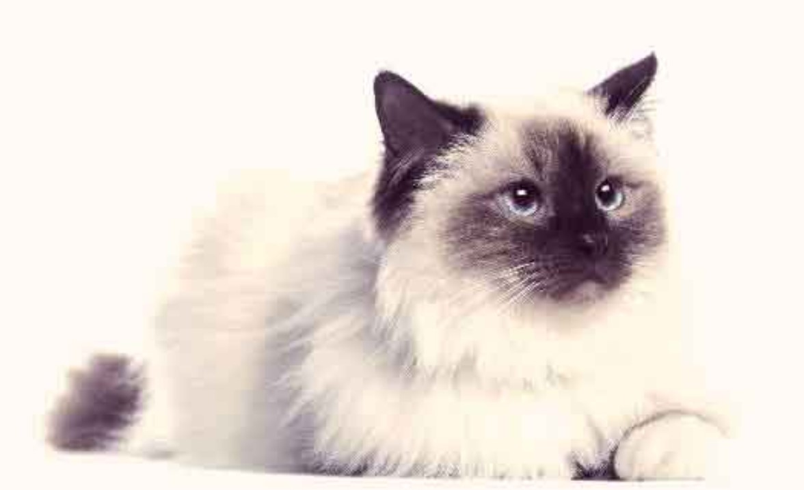
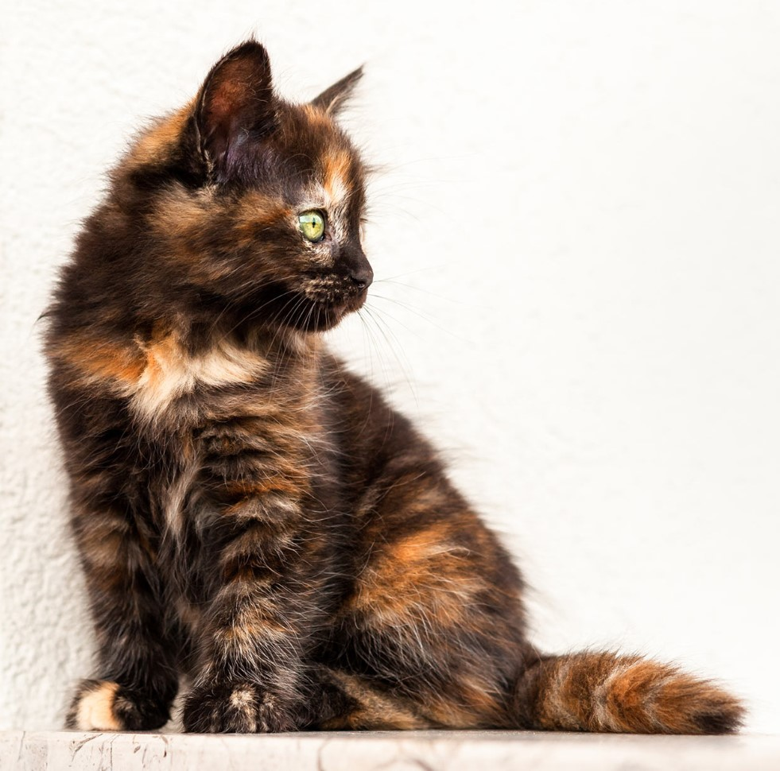
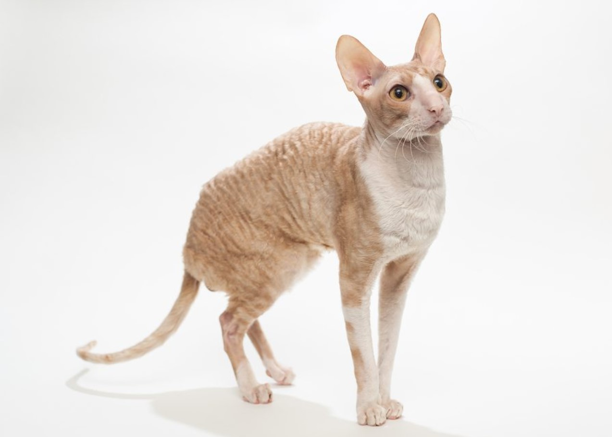
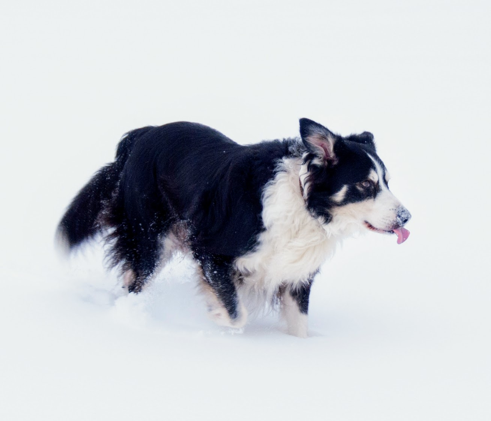
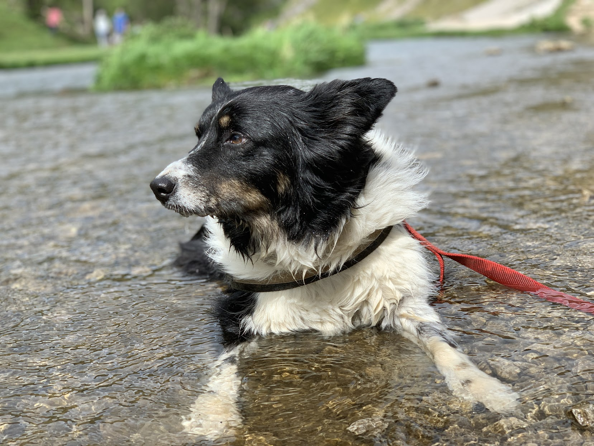
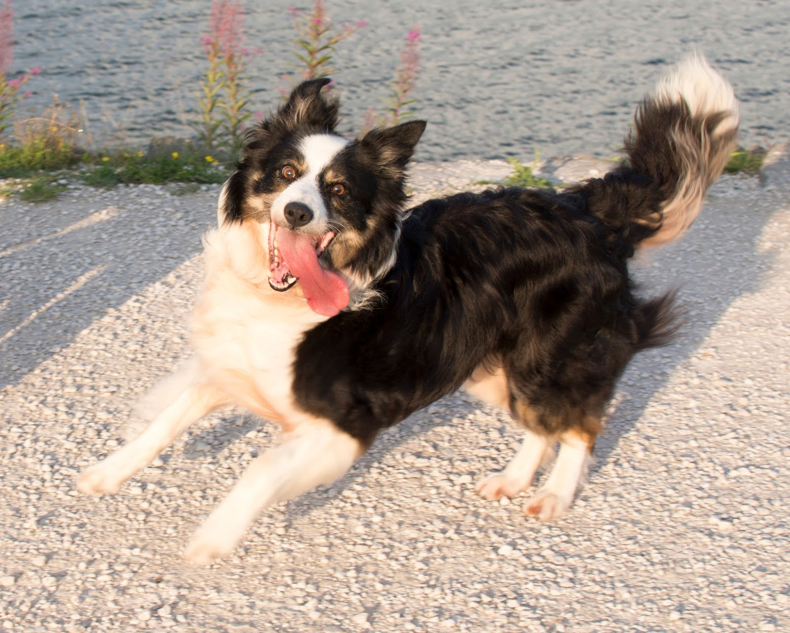
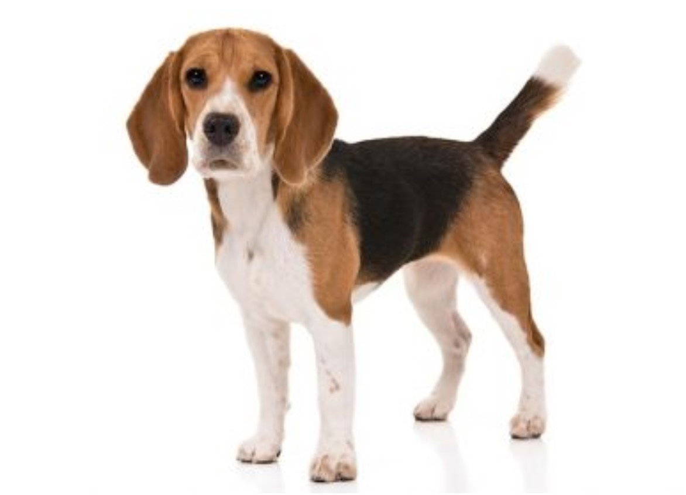
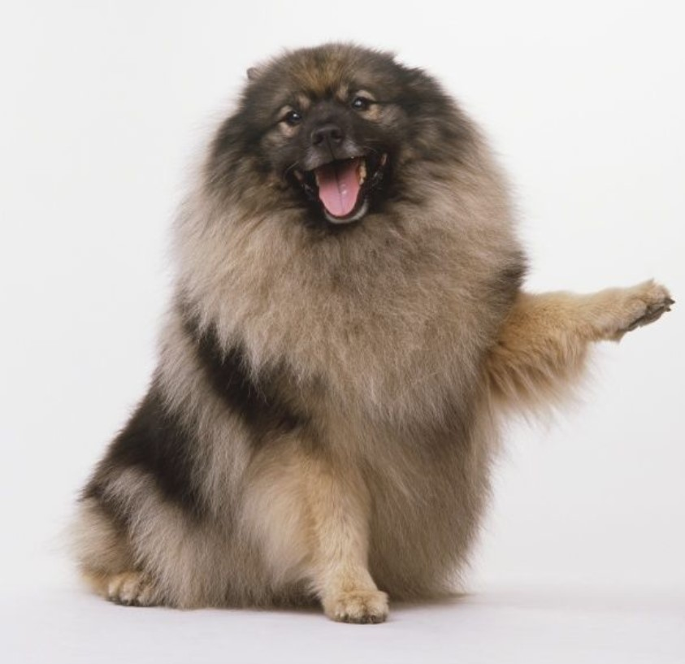
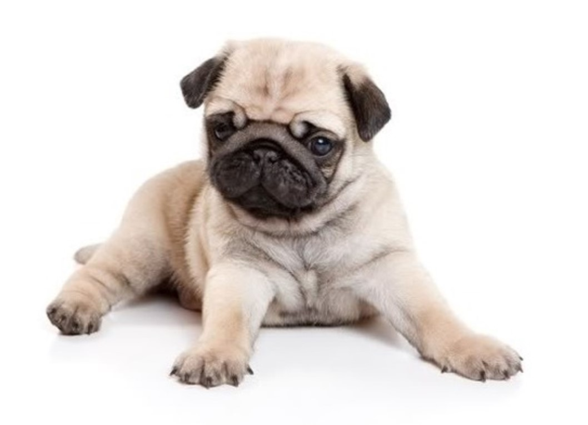

# An introduction to machine learning: image classification

# Intro

- I'll be using [Teachable Machine](https://teachablemachine.withgoogle.com/train/image) for this example
- It's a web-based tool for creating machine-learning models. I'll be showing an image classification example using cats and dogs.
- A more business relevant example might be in quality control: identifying good and bad components on a production line.

# The demo

- Train a machine learning model using [Teachable Machine](https://teachablemachine.withgoogle.com/train)

- Train the model to classify images as cats or dogs using a training dataset

- Essentially I'm giving some examples of each, and letting the model look for patterns in the data

- Test the model with different test images and review its classification power

# First model

- First training dataset has 15 images of cats and 6 images of dogs
- Three dogs incorrectly classified as cats.

---

| file       | image                               | cat    | dog    |
| ---------- | ----------------------------------- | ------ | ------ |
| Test1.jpg  |   | 100    | 0      |
| Test2.jpg  |   | 100    | 0      |
| Test3.jpg  |   | 86     | 14     |
| Test4.JPG  |   | 40     | 60     |
| Test5.JPG  |   | **89** | **11** |
| Test6.JPG  |   | **60** | **40** |
| Test7.jpg  |   | 12     | 88     |
| Test8.jpg  |   | 0      | 100    |
| Test9.jpg  |   | **95** | **5**  |
| Test10.jpg |  | 4      | 96     |

# Second model

- Use a training dataset with the same number of cats as dogs
- How does this affect the classification power using the same test images?
- One cat misclassified as a dog, and three dogs misclassified as cats.

---

| file       | image                               | cat    | dog    |
| ---------- | ----------------------------------- | ------ | ------ |
| Test1.jpg  |   | 99     | 1      |
| Test2.jpg  |   | 100    | 0      |
| Test3.jpg  |   | **21** | **79** |
| Test4.JPG  |   | 7      | 93     |
| Test5.JPG  |   | **88** | **12** |
| Test6.JPG  |   | **54** | **46** |
| Test7.jpg  |   | 8      | 92     |
| Test8.jpg  |   | 0      | 100    |
| Test9.jpg  |   | **57** | **43** |
| Test10.jpg |  | 2      | 98     |

# Third model

- Use a larger data set of training images. 12 cats, and 12 dogs
- Does this improve the classfication of the test images?
- There are still two dogs incorrectly classified as cats

---

| file       | image                               | cat    | dog    |
| ---------- | ----------------------------------- | ------ | ------ |
| Test1.jpg  |   | 100    | 0      |
| Test2.jpg  |   | 99     | 1      |
| Test3.jpg  |   | 73     | 27     |
| Test4.JPG  |   | 2      | 98     |
| Test5.JPG  |   | **97** | **3**  |
| Test6.JPG  |   | 34     | 66     |
| Test7.jpg  |   | 4      | 96     |
| Test8.jpg  |   | 0      | 100    |
| Test9.jpg  |   | **54** | **46** |
| Test10.jpg |  | 0      | 100    |

# Comparison of test results

---

| file       | image                               | cat    | dog    | cat    | dog    | cat    | dog    |
| ---------- | ----------------------------------- | ------ | ------ | ------ | ------ | ------ | ------ |
| Test1.jpg  |   | 100    | 0      | 99     | 1      | 100    | 0      |
| Test2.jpg  |   | 100    | 0      | 100    | 0      | 99     | 1      |
| Test3.jpg  |   | 86     | 14     | **21** | **79** | 73     | 27     |
| Test4.JPG  |   | 40     | 60     | 7      | 93     | 2      | 98     |
| Test5.JPG  |   | **89** | **11** | **88** | **12** | **97** | **3**  |
| Test6.JPG  |   | **60** | **40** | **54** | **46** | 34     | 66     |
| Test7.jpg  |   | 12     | 88     | 8      | 92     | 4      | 96     |
| Test8.jpg  |   | 0      | 100    | 0      | 100    | 0      | 100    |
| Test9.jpg  |   | **95** | **5**  | **57** | **43** | **54** | **46** |
| Test10.jpg |  | 4      | 96     | 2      | 98     | 0      | 100    |

# Take-home messages

- The process is a 'black box': it might perform well, but it might not. The model finds patterns in the data, but it might not find what's important to you. However...
- The predictive power is affected by the quality of the training data set.
  - You should be careful to remove bias from your training data set so that the model isn't biased in favour of the majority class, images with blank backgrounds, centred images, etc. [Short video on bias](https://youtu.be/59bMh59JQDo)
- There is time involved in getting good input data, but AI needs data to fuel it!

# Business applications

- "Spot the difference" is easier than "what is this?", so production line example should be an easier problem

- Cost-benefit of false positives vs false negatives - [are you a cat or a dog?]([Teachable Machine](https://teachablemachine.withgoogle.com/models/GnT5TW_bO/))
