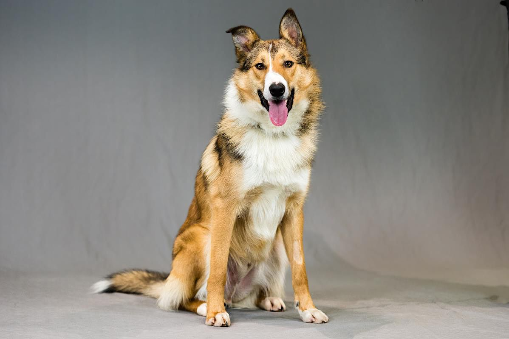

# Image classification demo

# Intro

- I'll be using [Teachable Machine](https://teachablemachine.withgoogle.com/train/image) for this example.
- It's a web-based tool for creating machine-learning models. I'll be showing an image classification example using cats and dogs.
- A more business relevant application might be in quality control: identifying good and bad components on a production line.

# The demo

- Train a machine learning model using [Teachable Machine](https://teachablemachine.withgoogle.com/train) 

- Train the model to classify images as cats or dogs using a training dataset

- Test the model with different test images and review its classification power

# First model

- First training dataset has 15 images of cats and 6 images of dogs
- Three dogs incorrectly classified as cats.

---

| file          | image                     | cat | dog |
| ------------- | ------------------------- | --- | --- |
| Test1.jpg     |   | 100 | 0   |
| Test2.jpg     |   | 100 | 0   |
| Test3.jpg     |   | 86  | 14  |
| Test4.JPG     |   | 40  | 60  |
| **Test5.JPG** |   | 89  | 11  |
| **Test6.JPG** |   | 60  | 40  |
| Test7.jpg     |   | 12  | 88  |
| Test8.jpg     |   | 0   | 100 |
| **Test9.jpg** |   | 95  | 5   |
| Test10.jpg    |  | 4   | 96  |

# Second model

- Train a model using a training dataset with the same number of cats as dogs
- How does this affect the classification power using the same test images?
- One cat misclassified as a dog, and three dogs misclassified as cats.

| file       | image                     | cat    | dog    |
| ---------- | ------------------------- | ------ | ------ |
| Test1.jpg  |   | 99     | 1      |
| Test2.jpg  |   | 100    | 0      |
| Test3.jpg  |   | **21** | **79** |
| Test4.JPG  |   | 7      | 93     |
| Test5.JPG  |   | **88** | **12** |
| Test6.JPG  |   | **54** | **46** |
| Test7.jpg  |   | 8      | 92     |
| Test8.jpg  |   | 0      | 100    |
| Test9.jpg  |   | **57** | **43** |
| Test10.jpg |  | 2      | 98     |

# Third model

- Use a larger data set of training images. 12 cats, and 12 dogs
- Does this improve the classfication of the test images?
- There are still two dogs incorrectly classified as cats

| file       | image                     | cat    | dog |
| ---------- | ------------------------- | ------ | --- |
| Test1.jpg  |   | 100    | 0   |
| Test2.jpg  |   | 99     | 1   |
| Test3.jpg  |   | 73     | 27  |
| Test4.JPG  |   | 2      | 98  |
| Test5.JPG  |   | **97** | 3   |
| Test6.JPG  |   | 34     | 66  |
| Test7.jpg  |   | 4      | 96  |
| Test8.jpg  |   | 0      | 100 |
| Test9.jpg  |   | **54** | 46  |
| Test10.jpg |  | 0      | 100 |

- TODO: 

- [ ] test with some 'fun' examples. Cartoons, wolves, lions

- [ ] demo in python

- [x] write python code to analyse the test folder and display results

- [x] pass model to load as command line argument

- [ ] make this into an actual slideshow

# Take-home messages

- The process is rather a black box: you don't have much control, so if it performs well that's great, but there's not much you can do if it doesn't do what you want.
- There is time involved in getting good input data. The robustness of the predictive algorithm is affected by the quality of the training data set.
  - Image segmentation may help as preprocessing step, as well as centering and orienting the images - the machine learning is looking for patterns, but the patterns found may not be the ones you think are important
  - You should be careful to remove bias from your training data set so that the model isn't biased in favour of the majority class. Maybe show this [video](https://youtu.be/59bMh59JQDo)?
- AI needs data to fuel it

# additional thoughts from discussion with David

- image segmentation - identifying the animals in a larger image rather than blank background

- nurse/doctor word example - see salford slides

- elephant in the room https://arxiv.org/pdf/1808.03305.pdf

- spot the difference is easier than what is this - production line should be an easier problem

- cost-benefit of false positives vs false negatives
